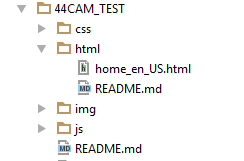

# The Primo New UI Customization Workflow Development Environment

##html documentation

 - In this folder you will find static html files in their OTB state
 - The files are separated into directories (starting from the November 2016 Release)
 - You can edit the html to comply with your library requirements
 - To support multiple languages in your interface just add a suffix with the language code to your file-name,
   For example:

   1. homepage_fe_FR.html (in the August 2016 Release use home_fe_FR.html)
   2. help_de_DE.html(Available in the November 2016 Release)

   -    This is how your directory structure should look like:

 

 - Note that you can use Angular Material directives in your html:
 > https://material.angularjs.org/latest/

