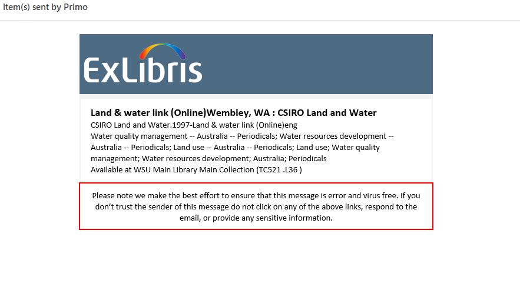
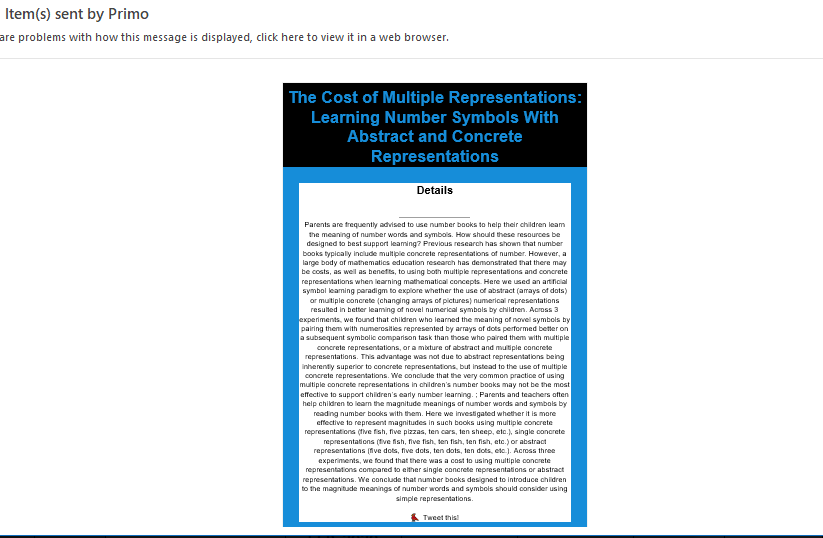

# The Primo New UI Customization Workflow Development Environment


## html documentation

 - In this folder you will find static html files in their OTB state
 - The files are separated into directories (starting from the November 2016 Release)
 - You can edit the html to comply with your library requirements
 - To support multiple languages in your interface just add a suffix with the language code to your file-name,
   For example:

   1. homepage_fe_FR.html (in the August 2016 Release use home_fe_FR.html)
   2. help_de_DE.html(Available in the November 2016 Release)

   -    This is how your directory structure should look like:

 


 - Note that you can use Angular Material directives in your html:
 > https://material.angularjs.org/latest/


## Email templates
  Starting from 2020 Primo supports a new html template to customize email messages sent to patrons'.
  
  To customize this template create a file named email_fr_FR.html (based on your language suffix) and upload it using the html directory in your customization package.
  
  In this html file you can design your own email template using html.
  
  When editing the template you can:
  
  1. Use regular html (use best practices for email templating: https://mailchimp.com/help/about-html-email/) to design the layout of your email based on your preferences.
  
  2. You can take advantage of some of our OTB directives in your templates:
      ```
      <prm-brief-result
             class="result-item-details"
             [item]="item"
             [is-email]="true"
             layout="column">
     </prm-brief-result>


    <prm-search-result-availability-line tabindex="-1" [result]="item" [is-email]="true"></prm-search-result-availability-line>

    <prm-logo style="height: 66px;"></prm-logo>

    <prm-service-details [item]="item" [is-email]="true"></prm-service-details>
    
 3. You can reference the sent item(pnx/record) using angular syntax to present the relevant data:
 
  use the curly brackets to access the pnx diectly - for example: 
   ```{{item.pnx.display.title}}```
  or loop over values using the ng-repeat directive to add multiple fields:
```
      <div dir="auto" ng-repeat="oclcid in     item.pnx.addata.oclcid">
      <div style="font-weight: 600;margin-top:2em;"> Additional Information From the Record:</div>
      <span ng-if="item.pnx.addata.oclcid" atyle="">OCLCID: </span>
      <div dir="auto" ng-repeat="oclcid in item.pnx.addata.oclcid">{{oclcid}}</div>
      

 


**Notice :** Any link in your template will be removed - for security reasons, we will not allow links other than the link to the record to avoid email exploits.


 ## Examples        
        
 Full examples of email templates can be found in the help files folder folder:
 
   1. [The Out of the Box template for emails](../../help_files/email_en_US.html) email_en_US.html
   
   2. [A template based on the OTB - brief + custom fields + availability](../../help_files/email_en_US-brief+additionalField+availability.html)
    will produce the following email:
   
   
    
   3. [A template based on the OTB - details + custom fields + availability](../../help_files/email_en_US_Details.html)
    will produce the following email:
    
   
 
   4. [A template based on an open source email template with no Primo directives - just use of the ```{{item.pnx.display.title}}```](../../help_files/email_en_US_Details.html)
    will produce the following email:
    
   


