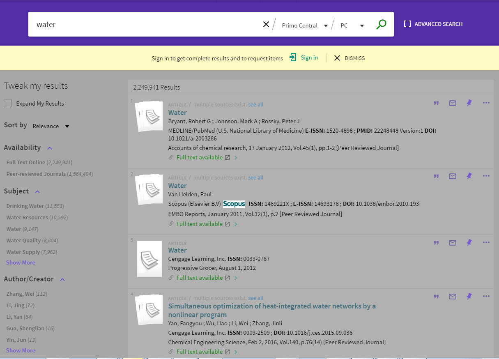

# The Primo New UI Customization Workflow Development Environment

## SCSS/SASS documentation

SASS is a preprocessor scripting language that is interpreted or compiled into Cascading Style Sheets (CSS). Thus, 
the information given in the [CSS documentation](https://github.com/ExLibrisGroup/primo-explore-package/tree/master/VIEW_CODE/css) generally applies.

However, SCSS/SASS statements can be expressed in a more succinct manner. Furthermore, you can split your SCSS/SASS statements across different files, use 
variables and [many other features](https://sass-lang.com/guide).

## Recipes/Examples:

# SASS/SCSS Recipe Moving the Facets to the Left

-  Select the parent container containing the search result and the facets
-  Copy the selector definition using your browsers' dev tools
-  Define the container as

```scss
display:flex;
flex-flow:row-reverse;
```

- complete scss/sass definition:

```scss

/* File main.scss */

@import "partials/facets";

/* File partials/facets.scss */

prm-search {
    > md-content.md-primoExplore-theme {
        .main,
        &.main {
            display: -webkit-flex; /* Safari */
            -webkit-flex-flow: row-reverse wrap; /* Safari 6.1+ */
            display: flex;
            flex-flow: row-reverse wrap;
        }
    }
}
    
.screen-gt-sm {
    .sidebar{
        webkit-flex: 0 0 15%;
        flex: 0 0 15%;
    }
}
```

-  Save and refresh your browser

-  The result:

 